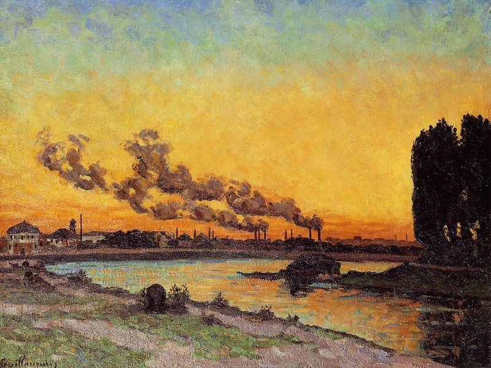
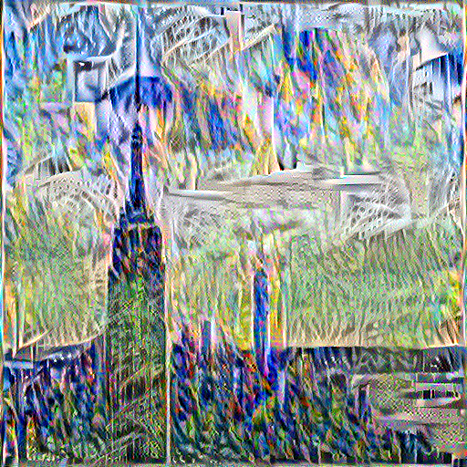

# Art-Generation-using-Neural-Style-Transfer
Here we take a Style image(S) and Content image(C) and genrate a image with style S and content C using transfer learing 
on VGG 19 model
 
 Example:

 
<h1> Content Image and Style Image </h1>

  

<h2> Generated Image </h2>
 

<h3> References </h3>
<ul>
  <li><a href=https://arxiv.org/abs/1508.06576> A Neural Algorithm of Artistic Style by Leon A. Gatys, Alexander S. Ecker, Matthias Bethge</a></li>
</ul>
